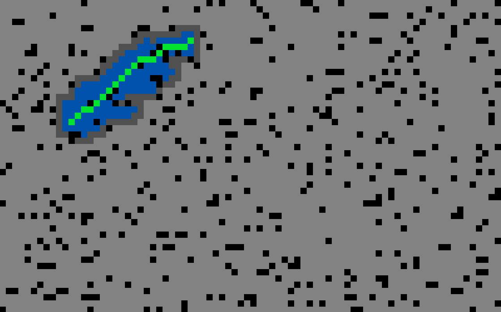
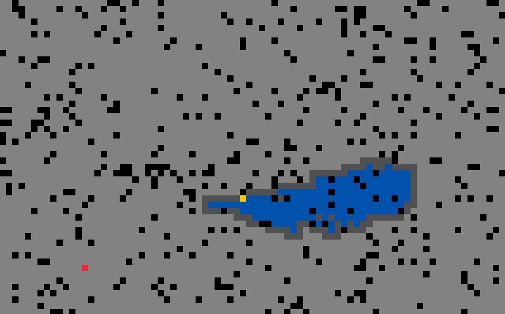

# Simple 2D playground
## About
Application written in C# which purpose is to test different 2D techniques. It uses C# bindings for raylib which is simple and easy to use graphics library. At the moment the only implemented algorithm is A* search algorithm for pathfinding.

## Features:
- Visualisation of pathfinding through grid cells
	- A* search algorithm

## Program behaviour
With the start of program the window appears with the generated world made of cells in regular grid. Each time a user clicks left mouse button it recreates world in random manner - deciding which cells are obstacles. Then it performes visualisation of pathfinding between two randomly selected cells in the world. When the shortest path is determined, then it highlights cells that participate in this path by coloring them to green.

